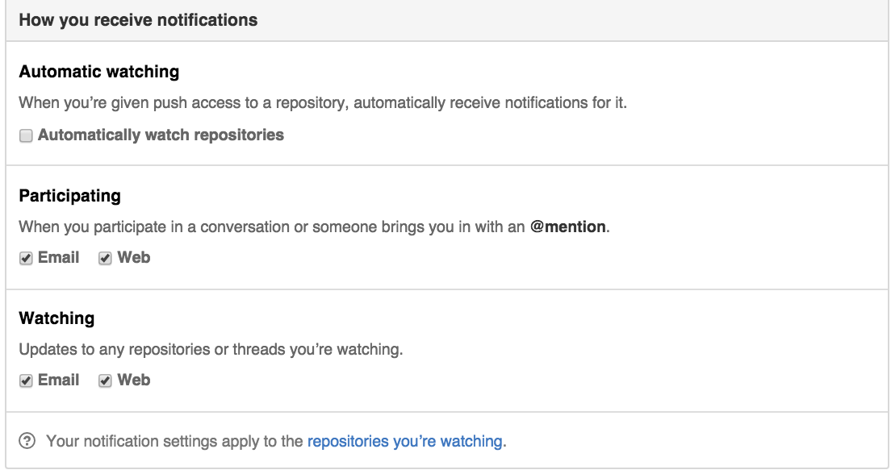
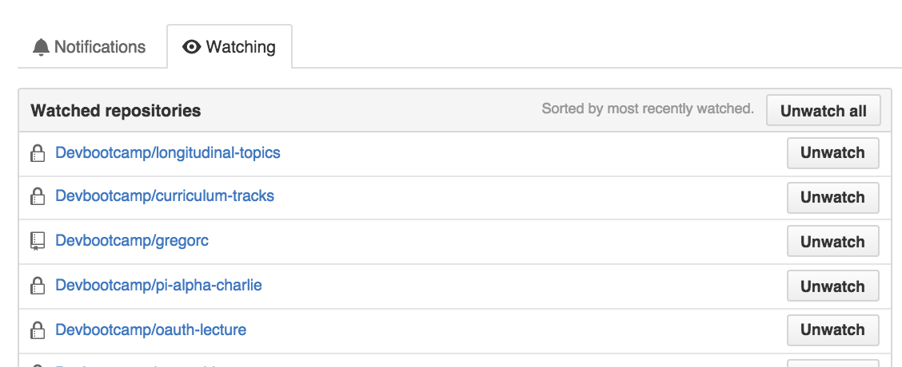
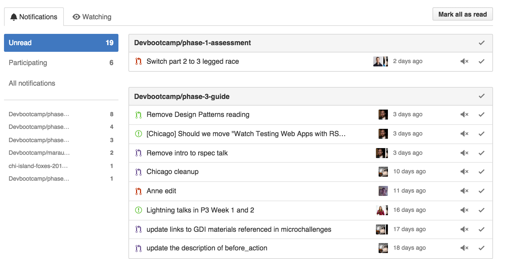
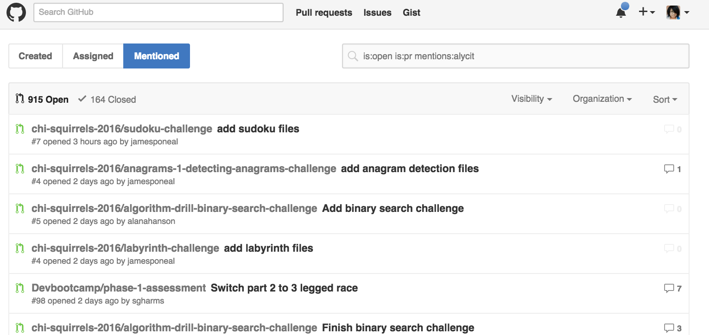

These are my notification settings... uncheck 'automatically watch' and leave everything checked.

Now... follow that link to 'the repositories you're watching'.  Unwatch everything and add back only the specific repos you want to watch using the 'unwatch all' repos button.  (If you want to keep watching everything, just uncheck the watching email / web checkboxes in the above screenshot to reduce that noice)  I have a short list of repos I watch as a 'white list'.  Likely you will want to watch your p3 final project or something you contribute you to maybe after graduation.  At this point, it's probably unnecessary.

Now click on the notifications tab and mark all as read.  (don't worry, I'll give you another way to see the ones we just removed that are important to you).  In the future the notifications you see here are now just the ones you want!

I will always mention you in the pull request with '@username Code review complete' so you can go to 'pull requests' in the top bar and click on 'mentioned' and see the PRs you have been mentioned in.

